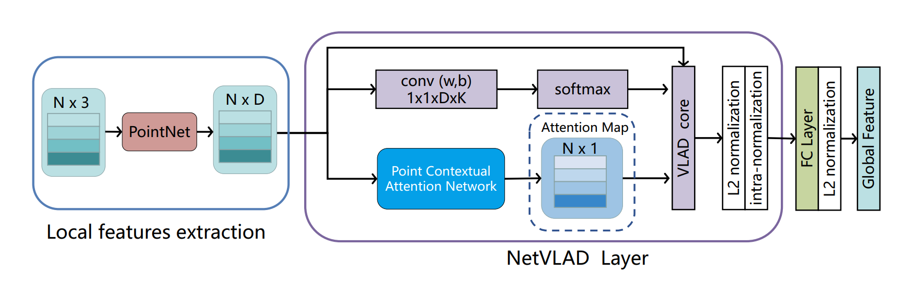

# PCAN: 3D Attention Map Learning Using Contextual Information for Point Cloud Based Retrieval

**[PCAN: 3D Attention Map Learning Using Contextual Information for Point Cloud Based Retrieval](https://arxiv.org/abs/1904.09793)** CVPR 2019

Wenxiao Zhang and Chunxia Xiao

Wuhan University
## Introduction
PCAN is an attention module for point cloud based retrieval, which can predict the significance of each local point feature based on
point context.
This work is based on [PointNetVLAD](https://github.com/mikacuy/pointnetvlad) and [Pointnet++](https://github.com/charlesq34/pointnet2).



## Pre-requisites
* Python3
* CUDA
* Tensorflow 
* Scipy
* Pandas
* Sklearn

For attention map visualization, matlab is also needed.

#### Compile Customized TF Operators
The TF operators are included under tf_ops, you need to compile them (check tf_xxx_compile.sh under each ops subfolder) first. Refer to [Pointnet++](https://github.com/charlesq34/pointnet2) for more details.

## Generate pickle files
Please refer to [PointNetVLAD](https://github.com/mikacuy/pointnetvlad).

## Training
To train our network, run the following command:
```
python train.py
```
To evaluate the model, run the following command:
```
python evaluate.py
```

## Pre-trained Models
The pre-trained models for both the baseline and refined networks can be downloaded [here](https://drive.google.com/open?id=1_vMkamy0zfULW01iWof5zXZOR8cu3Qns).

## Attention Map Visualization
For visualization, you can run the ```visualization/show_attention_map.m``` using matlab to visulize the attention map. We provide a weight file of a point cloud in ```oxford_weights``` folder.

To produce the weights of all the point cloud, you can run the following command:
```
python evaluate_save_weights.py
```
The the weights will be saved in .bin files in ```datasetname_weights``` folder.

You can also use the python lib ```mpl_toolkits.mplot3d``` for visualization.

If you want to produce the same visualization results in the paper, please use this [model](https://drive.google.com/open?id=1FqO6C8SWyx9lZFx8Pzah8DOKSYM5_RkA) which is an earlier trained refined model when we submited the paper.

## Contact
Feel free to contact me if you have any questions. wenxxiao.zhang@gmail.com
